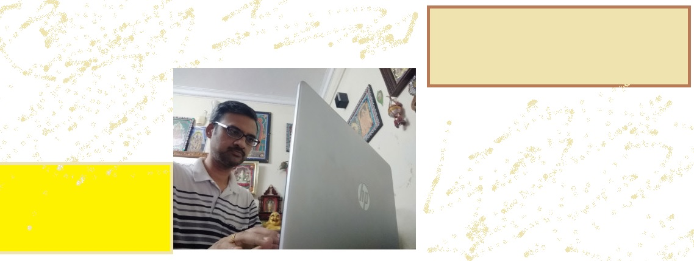

### Hi there 👋

    

<ul>
<li>My primary coding language is JAVA</li>
<li>Been part of software industry for ~ 18 years</li>
<li>🔭 I’m currently working on cloud</li>
    <li>🌱 I’m currently learning clustered architecture</li>
    </ul>
    

<!--
**kannanve/kannanve** is a ✨ _special_ ✨ repository because its `README.md` (this file) appears on your GitHub profile.

Here are some ideas to get you started:
- 🔭 I’m currently working on ...
- 🌱 I’m currently learning ...
- 👯 I’m looking to collaborate on ...
- 🤔 I’m looking for help with ...
- 💬 Ask me about ...
- 📫 How to reach me: ...
- 😄 Pronouns: ...
- ⚡ Fun fact: ...
-->
